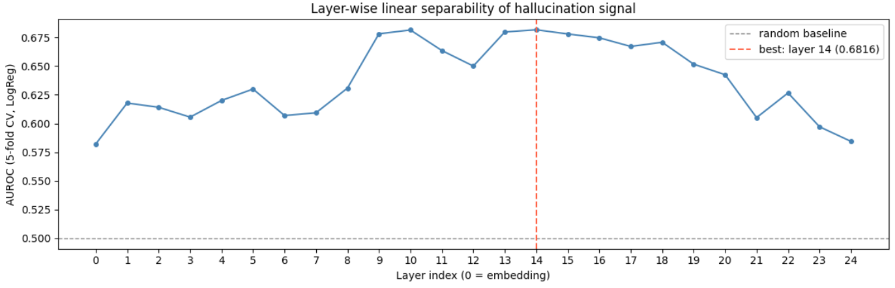

# SOLUTION — Hallucination Detection 

---

## **1. Reproducibility Instructions**

### Environment

- Python 3.12
- Google Colab with T4 GPU
- Dependencies: `requirements.txt`

### Setup

```bash
git clone https://github.com/yenaii/SMILES-2026-Hallucination-Detection
cd SMILES-2026-Hallucination-Detection
pip install -r requirements.txt
```
Then change `USE_GEOMETRIC` flag to `True`

### Run

```bash
python solution.py
```

It produces `results.json` and `predictions.csv` files.

---

## **2. Solution Description**

### Modifications

| File | Change |
|---|---|
| `splitting.py` | Single split was replaced with 5-fold StratifiedKFold |
| `aggregation.py` | Response-only hybrid mean+max token pooling on layer 16, response length in geometric features |
| `probe.py` | Replaced MLP with sklearn Pipeline: StandardScaler -> PCA -> LogisticRegression |

### Splitting: 5-fold StratifiedKFold

Because of rather small amount of samples and class disproportion (approximately 7 to 3), it was decided to use
cross-validation with 5 folds instead of initial single fold train-val-test scheme.

### Aggregation: response-only hybrid pooling on layer 16

A key finding from the initial data analysis was that hallucinated responses
are on average twice as long as truthful ones (with median 486 vs 221
characters). This means that aggregating over the full sequence of
prompt and response would dilute the signal. It is because prompt tokens obviously carry no
hallucination-related information. Therefore it was decided to identify where the response starts using the prompt
token length, then pool only response tokens.

Initially layer 14 was selected based on a layer-wise linear probe analysis
(see figure below): each layer's mean-pooled features were evaluated
independently with a LogReg (on 5-fold CV). Layer 14 was the best with AUROC
0.6816. But later in the full pipeline adjacent layers were also tested and layer 16 gave the best
result.



Hybrid pooling (mean and max concatenated) was used instead of
mean-only. Mean captures the average signal across all response tokens and
max captures the strongest signal in any single token. Together they
form an array of length 2×896 = 1792 that gives better representation of uncertainty in layer.

Response length (number of tokens in response), which usefullness was discovered in EDA,
 was appended as an scalar feature in `extract_geometric_features`.

### Probe: LogReg with PCA

The MLP consistently overfitted. Accuracy on train reached 98–100% while
test accuracy barely exceeded the majority-class baseline.
Therefoe a neural network with large amount of parameters was thought to be not an appropriate approach
to deal with rather small dataset containing ~550 training samples.

`LogisticRegression` with L1 regularization was chosen because:
- It has far fewer parameters (one weight per feature)
- `PCA(128)` reduces the 1793-dimensional input before classification,
  removes noise and significantly reduces overfitting.
- L1 regularization performs automatic feature selection
- `class_weight='balanced'` handles the 7/3 class imbalance


### What contributed most

| Contribution | 
|---|
| Response-only tokens (vs full sequence) | 
| LogReg with PCA instead of MLP  | 
| Layer 16 instead of layer 24 | 
| Mean+Max hybrid pooling | 
| Response length feature | 
| Hyperparameter tuning | 

Altogether it gave AUROC 79.82%

---

## **3. Experiments and Failed Attempts**

### Failed experiments

| # | Aggregation | Probe | Test AUROC | Why discarded |
|---|---|---|---|---|
| 1 | Last token, layer 24 baseline | MLP original | 73.56% | Overfitsing |
| 2 | Mean-pool layers 13–24 | MLP original | 67.24% | 12×896=10752 features -> catastrophic overfitting |
| 3 | Mean-pool layers 13–24 | MLP + PCA(128) | 64.90% | MLP still overfits even after PCA |
| 4 | Mean-pool layers 13–24 | LogReg + PCA(128) | 65.63% | Wrong layers: last layer don't carry enough useful signal |
| 5 | Last 4 layers + cosine similarity | MLP + BN + Dropout | 60.55% | Cosine features too sparse and MLP overfits |


### Key insights

**Full-sequence pooling dilutes signal:** Prompt tokens dominate the
sequence (mean 1300 chars vs 418 chars for truthful and 790 for hallucinated response). 
Pooling the full sequence averages away the response signal that individually
carries hallucination information.

**Wrong layer selection:** Initially was assumed that the last layers (last half or last 4)
were most informative. The layer-wise probe analysis showed that
middle layers carry stronger hallucination signal, with
layer 14 peaking at AUROC 0.6816. The last layer (24) scored only
0.5844 which is closer to random.

**Concatenation vs averaging:** Concatenating 12 layers (10752 dims) with only 551 training samples
caused severe overfitting. Also averaging layers probably caused
lost of per-layer information. The optimal
approach was to pick one good layer rather than combine many.

**MLP is too powerful for this dataset:** Every MLP variant reached almost
100% train accuracy while test performance was not so good. Simpler models
with strong regularization were found to be far better.


